# JoyousSpring - Balatro Mod

Balatro mod that adds modern Yu-Gi-Oh! cards to the game.

## Installation

1. Install [Steamodded](https://github.com/Steamopollys/Steamodded) [(version >1.0.0)](https://github.com/Steamodded/smods/wiki)
2. Download the [latest release](https://github.com/nh6574/JoyousSpring/releases)
3. Extract the zip file into its own folder inside your Balatro mods folder (%appdata%\Balatro\Mods)

Make sure to check the Glossary and the Config in Main Menu > Mods > JoyousSpring

Has compatibility with [JokerDisplay](https://github.com/nh6574/JokerDisplay) version >1.8.2

Check out the [Discord](https://discord.gg/Ac5FKpQCRV) for troubleshooting and chatting about the mod <3

## Known Issues and future ideas

- Still very much WIP
- Extra Deck renders behind consumables so buttons on right-most Jokers can be tricky to press. (For now, just move it)
- Extra Deck and summon material selection doesn't work properly with a controller
- It hasn't been tested with other mods (other than JokerDisplay) so it might not play well with them

- The Ghost Girls will eventually be Legendary instead of rare
- I'm bad at game design so I will take any feedback on effect balancing

## Screenshots

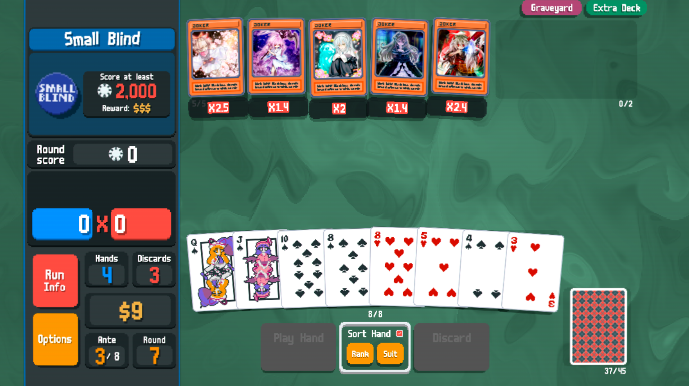
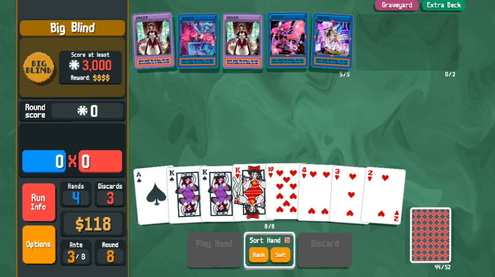
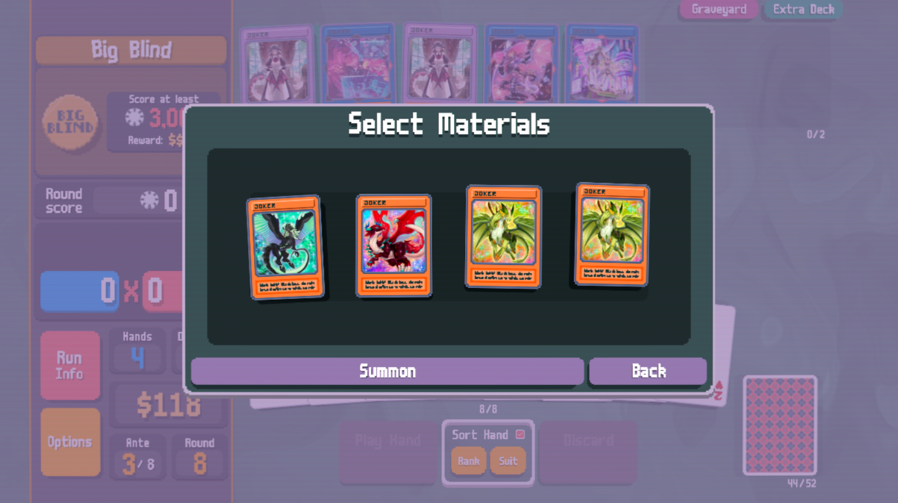
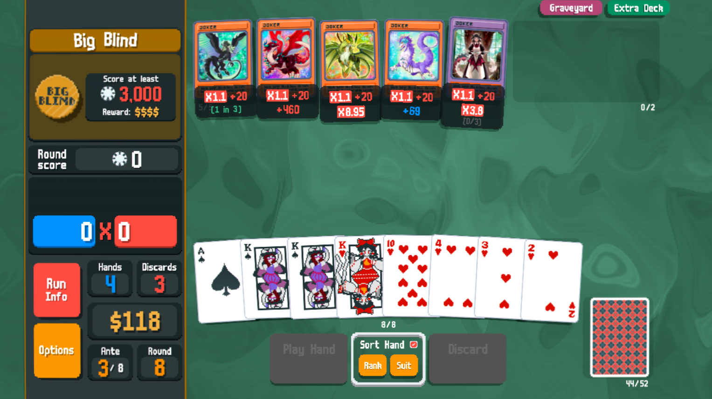
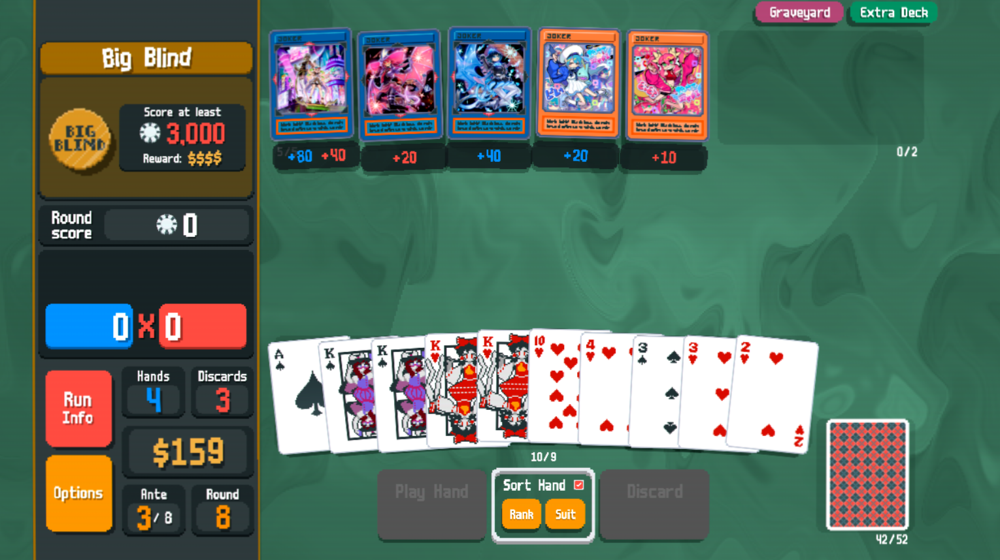
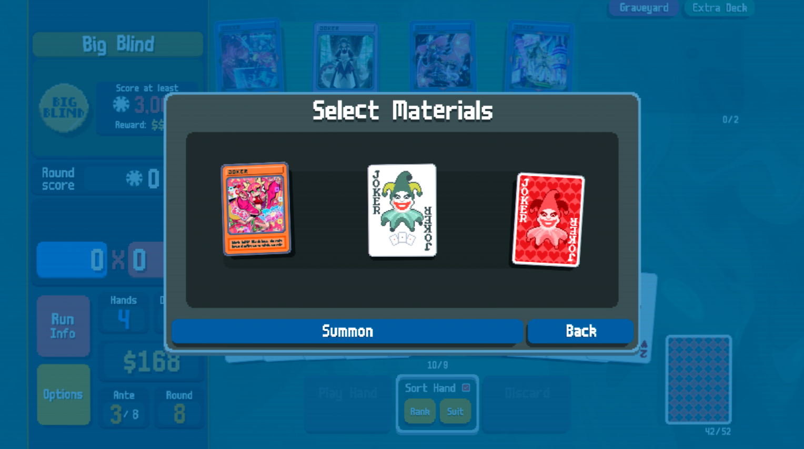
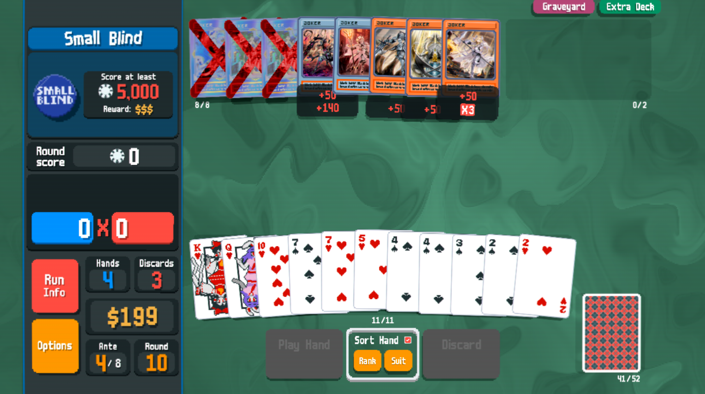
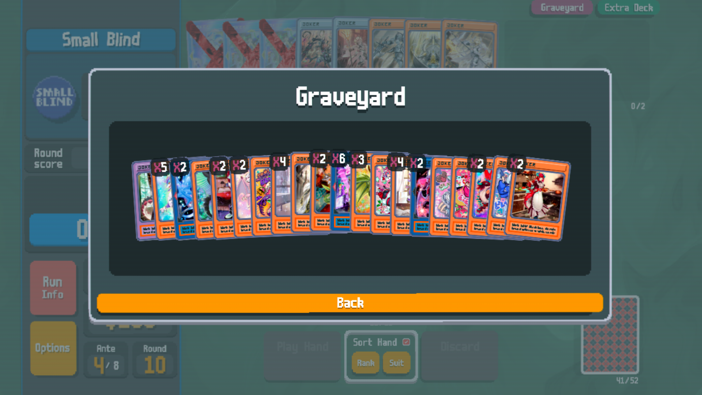

## Currently implemented

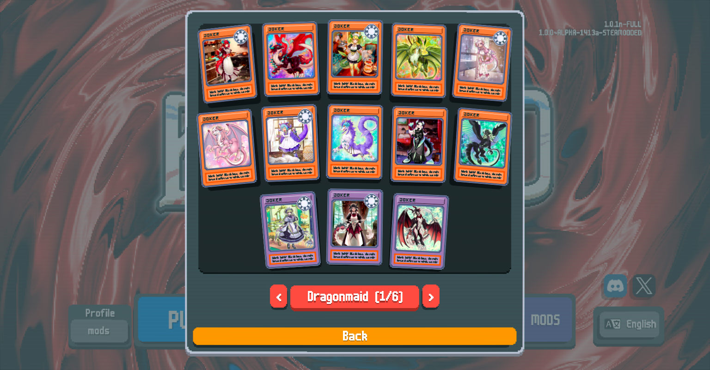

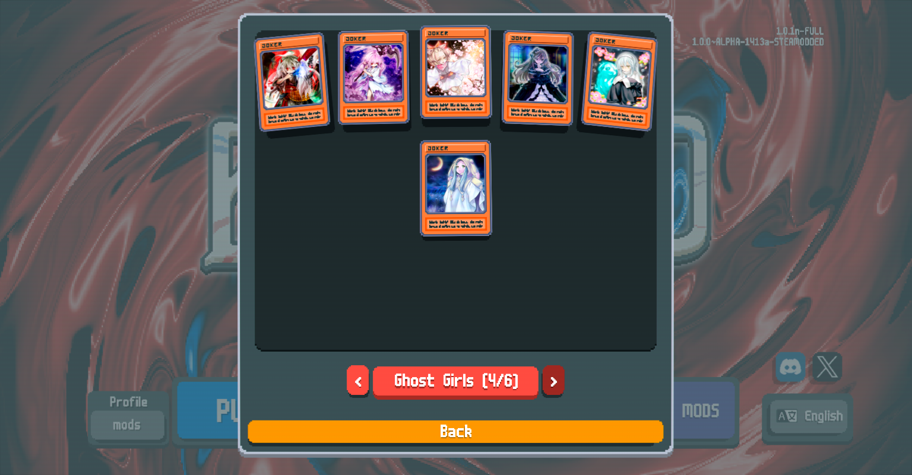
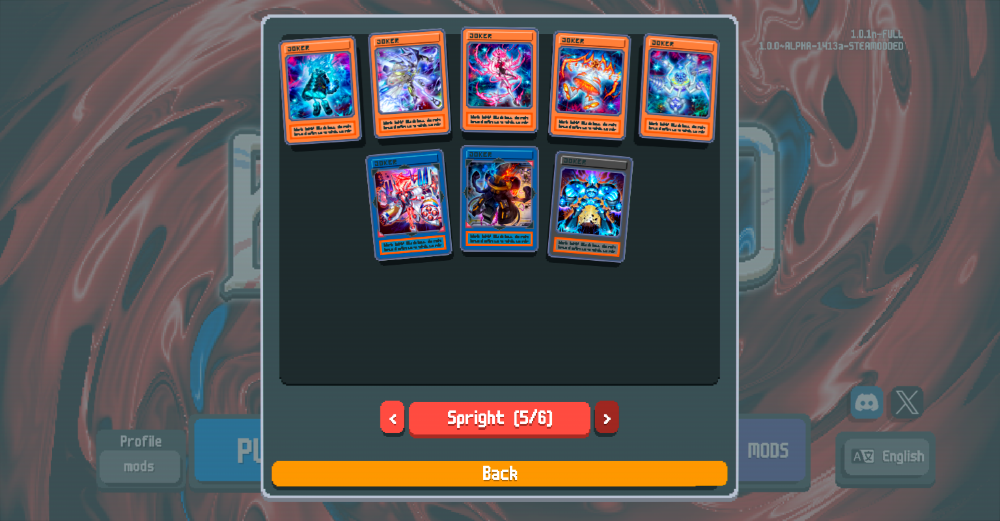
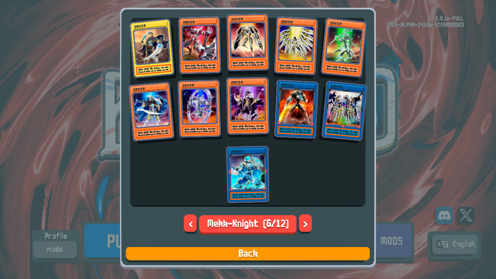
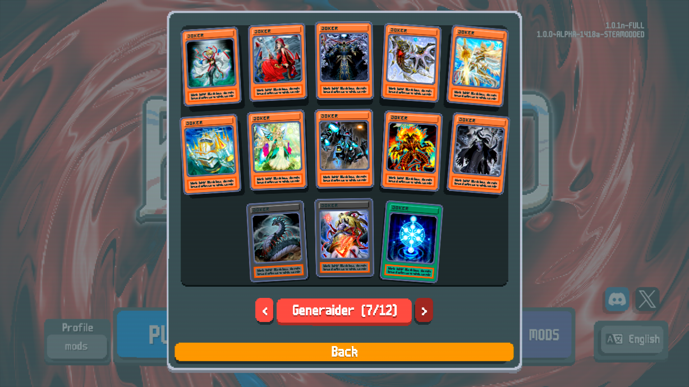
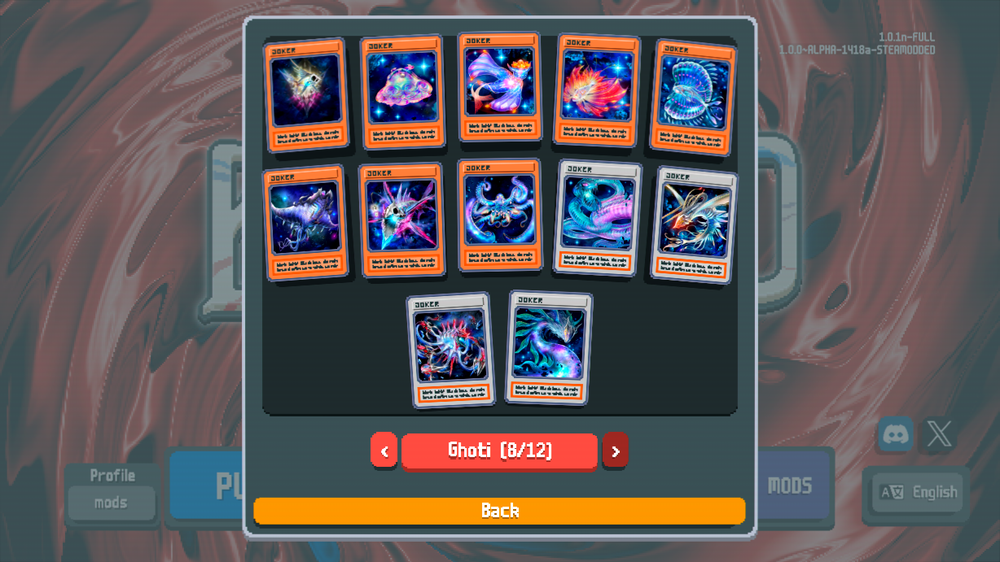
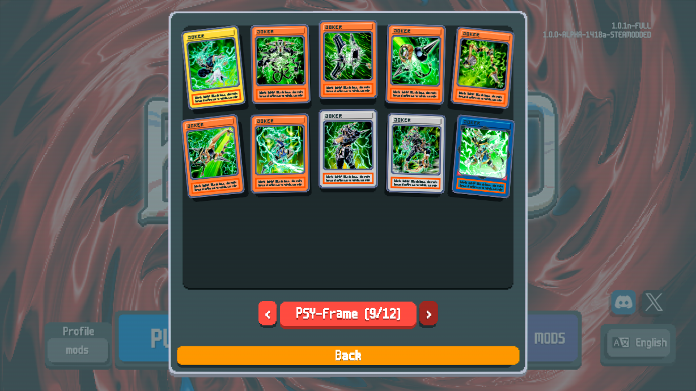
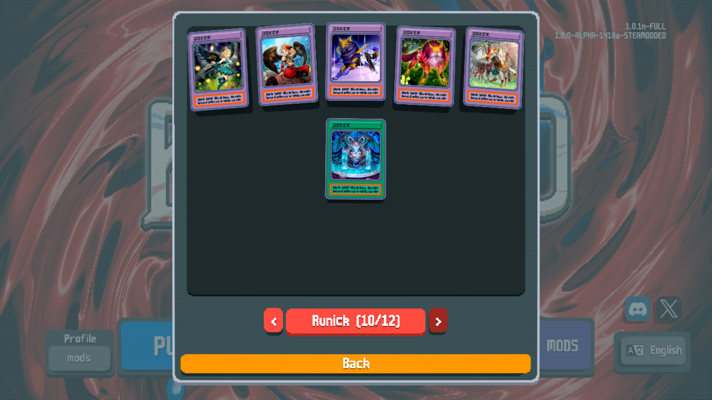
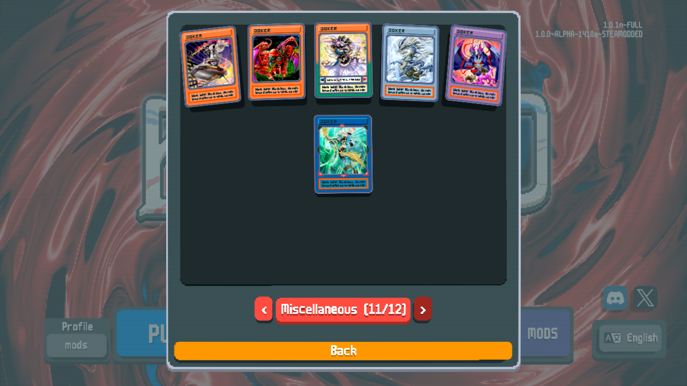
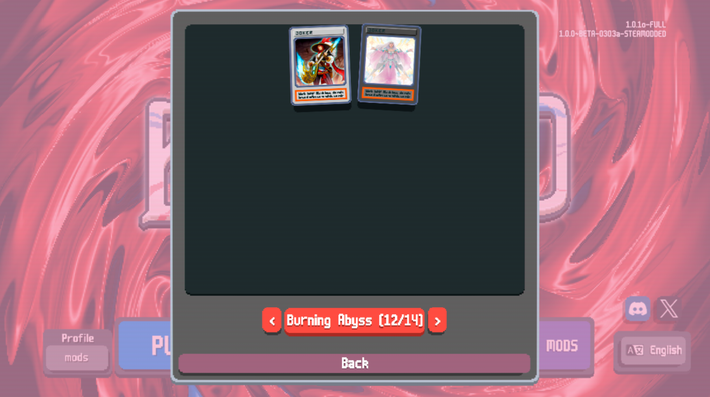

## Contributing

I might drop this at any moment (if I haven't already), so please feel free to fork or do PRs if you feel like you can improve on this or fix any of the problems above!

I will be strict with any card constributions that don't fit the theme of the mod. Also, when contributing an archetype I'm not merging PRs until a minimum viable version of the entire archetype is finished.

## Contact

If you have any issues feel free to contact me on [Bluesky](https://bsky.app/profile/nh6574.com) or [on the official Balatro Discord as nh6574](https://discord.com/invite/balatro)

And here's my [ko-fi link](https://ko-fi.com/nh6574) if you feel especially grateful.

Also check out my Quality of Life mod [JokerDisplay](https://github.com/nh6574/JokerDisplay)!
